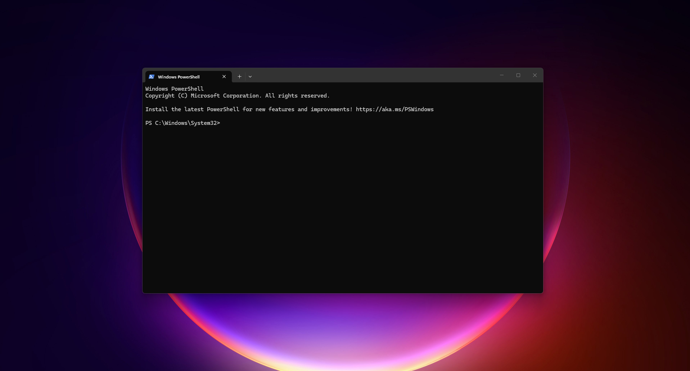
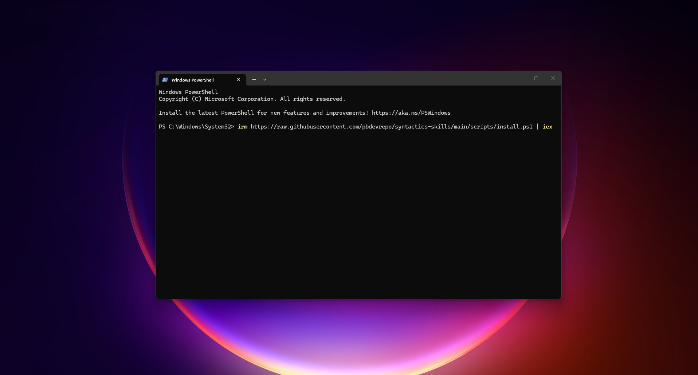
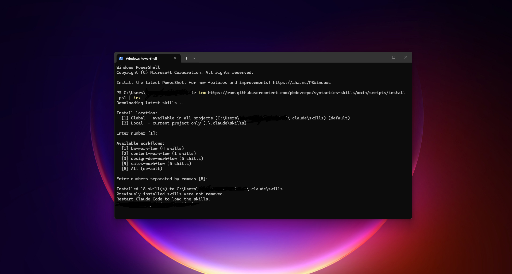
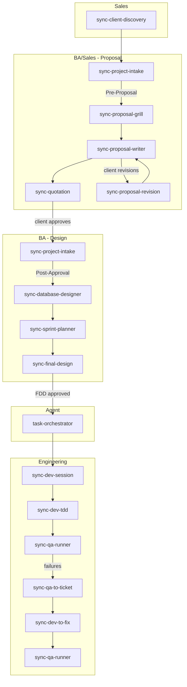

# Syntactics Skills

Claude Code skills for Syntactics Inc. internal workflow automation.

## Team Setup

New team member? Follow these steps once to get skills running on your machine.

### Prerequisites

| Requirement | Notes |
|-------------|-------|
| [Claude Code](https://claude.ai/code) | Desktop app or CLI — must be installed and logged in |
| PowerShell (Windows) or Terminal (Mac/Linux) | Built-in on all supported OS |
| Internet access | Install script pulls from GitHub |

> No Git, Node, or Python required. The install script has no dependencies.

### Steps



**1. Open a terminal**

- Windows: open **PowerShell** (not CMD)
- Mac/Linux: open **Terminal**

**2. Run the install script**



Windows:
```powershell
irm https://raw.githubusercontent.com/pbdevrepo/syntactics-skills/main/scripts/install.ps1 | iex
```

Mac/Linux:
```bash
curl -fsSL https://raw.githubusercontent.com/pbdevrepo/syntactics-skills/main/scripts/install.sh | bash
```

**3. Choose install location**



Select **Global** (installs to `~/.claude/skills/`) — skills available in all projects.

**4. Select your workflows**

Pick the workflows matching your role:

| Role | Workflow(s) to select |
|------|-----------------------|
| Sales | `sales` |
| Business Analyst | `ba` (includes proposal skills) |
| Designer | `pm` |
| Frontend / Backend Developer | `pm`, `engineering` |
| QA Tester | `qa` |
| Content Writer | `content` |
| All roles | Select all |

> `must-have` (caveman, grill-me, grill-with-docs) installs automatically.

**5. Restart Claude Code**

Close and reopen Claude Code (desktop app) or restart your CLI session.

**6. Verify**

In any Claude Code session, type:
```
/sync-caveman
```
Claude should respond in compressed mode. Skills are working.

### Updating Skills

Re-run the same install command from Step 2. The script overwrites existing skills with the latest from `main`.

### Advanced: Non-Interactive Install

Skip prompts by passing flags directly.

Windows:
```powershell
$url = "https://raw.githubusercontent.com/pbdevrepo/syntactics-skills/main/scripts/install.ps1"
& ([scriptblock]::Create((irm $url))) -Global -Workflow sales,ba   # specific workflows
& ([scriptblock]::Create((irm $url))) -Local -Workflow ba          # local project only
& ([scriptblock]::Create((irm $url))) -Skill sync-project-intake,sync-proposal-writer  # specific skills
```

Mac/Linux:
```bash
curl -fsSL https://raw.githubusercontent.com/pbdevrepo/syntactics-skills/main/scripts/install.sh | bash -s -- --global --workflow sales --workflow ba
curl -fsSL https://raw.githubusercontent.com/pbdevrepo/syntactics-skills/main/scripts/install.sh | bash -s -- --local --workflow ba
curl -fsSL https://raw.githubusercontent.com/pbdevrepo/syntactics-skills/main/scripts/install.sh | bash -s -- --skill sync-project-intake --skill sync-proposal-writer
```

| Flag | Effect |
|------|--------|
| `-Global` / `--global` | Install to `~/.claude/skills/` (all projects) |
| `-Local` / `--local` | Install to `./.claude/skills/` (current project only) |
| `-Workflow` / `--workflow` | Select specific workflow(s) |
| `-Skill` / `--skill` | Select specific skill(s) |

---

## Workflows

### Sales (`sales-workflow`)

Commercial pipeline skills - discovery, revisions, and pricing.

| Skill | Description |
|-------|-------------|
| `sync-client-discovery` | Research-first discovery session for clients with no brief - researches domain standards, maps competitor landscape, and produces a single fillable discovery brief the sales rep takes into the client meeting |
| `sync-proposal-revision` | Apply client feedback to produce a new versioned intake file and revised proposal |
| `sync-quotation` | Generate itemized module/feature list with placeholder hour ranges per role |

### Business Analysis (`ba-workflow`)

Proposal and design pipeline - from first client input through Final Design Document.

| Skill | Description |
|-------|-------------|
| `sync-project-intake` | Entry point for proposal and BA work - accepts client brief, RFP, meeting notes, or approved proposal; two modes: Pre-Proposal (Draft status, feeds proposal-grill) and Post-Approval (Approved status, feeds database-designer); produces `docs/ba/{project-name}-intake.md` |
| `sync-proposal-grill` | Stress-test the intake document for missed modules, ambiguous scope, and deployment constraints before writing the proposal |
| `sync-proposal-writer` | Write a client-facing project proposal from the grilled intake document, with automatic version numbering and a recommended deployment stack section |
| `sync-database-designer` | ERD design, normalization, schema best practices, Laravel/Eloquent conventions, spatie/laravel-permission and spatie/laravel-activitylog integration |
| `sync-sprint-planner` | Convert approved DB schema into development task list |
| `sync-final-design` | Produce Final Design Documents (FDD) - outputs `docs/fdd/index.md` (General Instructions, Figma link, module directory) plus one `docs/fdd/{module-slug}.md` per module |

### PM (`pm-workflow`)
| Skill / Agent | Description |
|---------------|-------------|
| `task-orchestrator` (agent) | Auto-triggered by sync-final-design after FDD approval. Detects FDD version drift and reruns automatically. Stage 1 generates backend tasks and UI design tasks in parallel (both from FDD directly); Stage 2 generates frontend tasks from both Stage 1 outputs; no TBD endpoints |
| `sync-design-to-stories` | Analyzes design mockup images (PNG/JPG/PDF) and generates structured user stories and acceptance criteria per page with MP/US/AC IDs - standalone, no workflow dependencies |

### Engineering (`engineering-workflow`)
| Skill | Description |
|-------|-------------|
| `sync-dev-setup` | One-time per-repo setup - scaffolds `## Agent skills` block and `docs/agents/` files so engineering skills know the issue tracker, triage labels, domain doc layout, and available MCPs/local skills; re-run when MCPs change |
| `sync-dev-session` | Task-level grilling session anchored to FDD - invoked as `/sync-dev-session BE-0001 users-module @tasks.md @fdd.md`; session type auto-derived |
| `sync-dev-tdd` | TDD red-green-refactor loop per task or module; enforces framework conventions (Laravel, shadcn, WordPress), runs tsc and ESLint as inline quality gates, adds jest-axe a11y checks for FE sessions, and generates Playwright E2E tests post-loop |
| `sync-dev-to-fix` | TDD-driven bug fix loop from a GitHub issue - fetches, fixes, posts result |
| `sync-dev-diagnose` | Disciplined diagnosis loop for hard bugs and performance regressions - reproduce, minimise, hypothesise, instrument, fix, regression-test |
| `sync-improve-codebase-architecture` | Find deepening opportunities in a codebase informed by CONTEXT.md and ADRs - refactoring, module consolidation, testability improvements |
| `sync-grill-with-docs` | Grilling session that challenges a plan against the existing domain model and updates CONTEXT.md and ADRs inline as decisions crystallise |

### QA (`qa-workflow`)
| Skill | Description |
|-------|-------------|
| `sync-qa-runner` | Verify a feature against the FDD. Direct mode: `/sync-qa-runner {issue URL} @{fdd}.md` - derives test cases from FDD inline, runs them, applies `verified` label on all pass. Legacy mode: `/sync-qa-runner [module-slug]` - reads existing qa-plan index |
| `sync-qa-to-ticket` | Convert QA failures into child GitHub issues with FDD references and parent issue link. Supports Direct mode (pass issue URL) and Legacy mode (pass qa-plan index) |

### Must-Have (`must-have-workflow`)

Always installed regardless of workflow selection.

| Skill | Description |
|-------|-------------|
| `sync-caveman` | Ultra-compressed communication mode — cuts token usage ~75% |
| `sync-grill-me` | Interview the user relentlessly about a plan or design until reaching shared understanding |

### Content (`content-workflow`)
| Skill | Description |
|-------|-------------|
| `sync-web-content-writer` | Write and optimize static web pages - homepages, service pages, about pages, landing pages, FAQ sections, and portfolio entries |
| `sync-article-writer` | Write and optimize blog posts and articles - how-to guides, listicles, opinion pieces, pillar content, and news articles |
| `sync-content-strategist` | Audit existing content for SEO and AI readability issues, rewrite flagged sections, and produce content strategy recommendations |

## Workflow Sequence



QA plan artifacts are written to `docs/qa/qa-plan/`. All other artifacts are written to `docs/{workflow-phase}/{artifact}.md`.

## Development

Skills are developed directly in the `skills/` directory. Push to `main` — the install scripts download the latest from `main` automatically. No CI required.

To test a change:
1. Edit skills in `skills/{workflow}/{skill}/SKILL.md`
2. Push to `main`
3. Run the install command above to get the latest version

`project directory: & ".\scripts\install.ps1" -Dev -Global`

## Structure

```
skills/
  {workflow}-workflow/
    {skill-name}/
      SKILL.md          # skill definition + frontmatter (name, version, description)
      references/       # supporting templates, question banks, output formats
scripts/
  install.ps1           # Windows install script
  install.sh            # Mac/Linux install script
```
